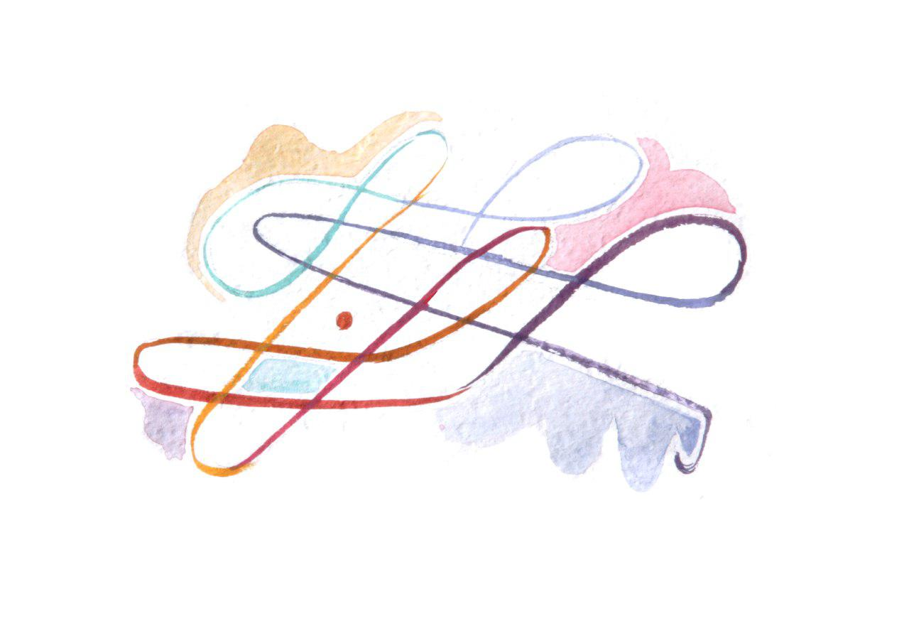

# Step 3: Generating direction with high-quality proposals

**Filling your funding round with high quality proposals that are aligned enough with DAO members to pass is the ultimate achievement that a DAO needs to function. As you will see once you get started, generating relevant and aligned proposals is a lot more difficult than it seems.**

“High-quality” can mean many different things depending on the purpose and objective of your DAO. To survive, any organization needs to be able to carry out strategic and operational tasks. Hence your DAO needs to be to generate proposals that range from high-level strategic actions to simple day-to-day tasks.   

Proposals do not just come out of nowhere, they emerge from interactions and discussions between members of the DAO who have ideas, see problems that need solving and opportunities to develop.

If a tool like Alchemy itself and a proposal comment function were the only ways for people to interact around such a budgeting process, one's ability to generate good proposals would be very limited. Why? Because high quality proposals are often the result of more than one brain working on it together, and having gone through multiple feedback and adaptation cycles. It is so important to offer your community of users ways to self-organize and deliberate together. Whether you are receiving a high amount of good proposals is not only an indicator of whether you have found the right incentive structure, but the health of your group culture. A strong shared culture can be an key lubricant to a successful proposals process.

