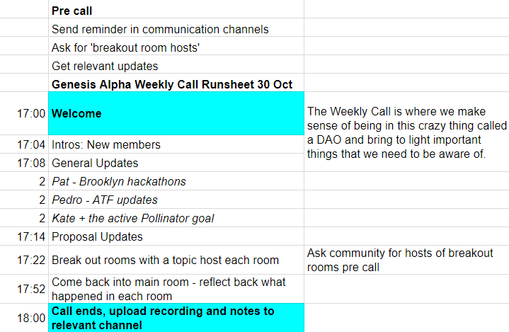

# Tactics and methods for generating direction

## 1. Create alignment through articulated goals and objectives.

Having a clear purpose and shared goals are a powerful way to align a group towards collective action. As for DAOs, there is an ongoing debate about the kind of goals and objectives a DAO could or should have. If a DAO has no collective objective - which updates as the DAO changes and iterates - agents will not know what types of proposals to make.

In the Genesis Alpha community for instance, the need for goals has been acknowledged and a practice has established itself around it. We define goals as tangible, qualitative and implementable. We define objectives as “North Stars” - or an agreed upon direction for the DAO. If a DAO member would like to propose a goal, they submit a “non-financial proposal” in Alchemy and if it passes it is adopted by the DAO.

## 2. Foster a “proposal mindset.”

Similar to the principle  “safe enough to try”, instilling a “proposal mindset” is important to turn talk into action. Asking the questions: “Is this ripe for a proposal?”, or “here does a potential proposal sit beneath a topic being discussed?” are ways to draw attention to action.

## 3. Create spaces for collective deliberation, strategic reflection and self-organization.

While holographic consensus plays an important role in creating alignment, this also needs to happen off-chain, by creating shared context and enabling individuals to self-organize around topics of interest. If people can work in groups of three to generate proposal ideas, they will be much more successful than if everyone is trying to come up with ideas alone. Here are some things you can try:

### **Online Forum and group chat.** 

Have channels for casual conversation as well as channels for deeper discussion of proposals or other governance issues. The Genesis DAO uses Telegram for generic discussions, Discord for deeper discussion and proposal channels.

### **Working Groups** 

These are a useful mechanism for helping small groups of people align to get work done. They are \(often temporary\) groups of people sharing knowledge and working on a topic for a certain period of time, which dissolve when the work is completed. Examples of working groups could be a values, use-case mapping or open source development working group.

### **Weekly calls**

In the Genesis Alpha DAO one of our key points of culture contact and ways for agents to get information and context is via the Genesis Weekly Call. This takes place at the same time every week for one hour. It is facilitated by an expert facilitator but anyone could facilitate it.  A note-taker \(rotating role\) takes notes and we store this openly so that anyone can access it.


**Tips of things to include in a weekly community call:**

* Ask new members of the DAO are asked to introduce themselves in 30 seconds
* Make time is made at the beginning of the call for crucial updates and notices
* Reserve 5-10 min for “proposal accountability”updates, where people with passed proposals are asked to feed back on the state of their proposal
* Use breakout rooms \(a feature of Zoom\) to work in smaller groups


### **Facilitation**

If you are using meetings or online calls as a way to align and connect it is important to utilize facilitation. Facilitators can help the group achieve outcomes and co-create. 


Tips for facilitating Zoom calls

* Make sure you have a stable internet connection
* Share the rules for "Zoom hygiene" with participants: 
  * Mute microphone when not speaking
  * Raise your hand if want to say something
  * Turn on your video
* Remember to document what happens to share afterwards
  * Record the call 
  * Ask for a note-taker
  * Have a template ready for note-taking


