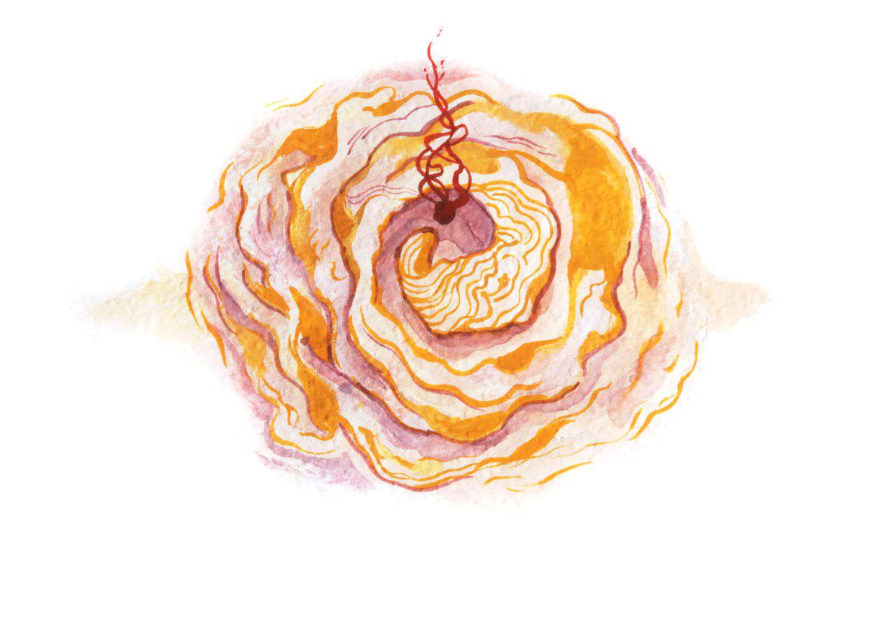

# Step 4: Get those proposals funded

Even when a proposal is high quality and aligned with the objectives of the DAO, it still is only about half way there to being successful. The success of a proposal also depends on the level of engagement and excitement the proposer is able to create around their proposal. The skill and knowledge of a group that is needed to create engagement around a proposal is often underestimated. As a person starting a new DAO, it is important you set the right expectations in your community for what it takes to get a proposal passed, and make them aware that creating engagement is part of the “work” they need to take into account.

## Tactics and Methods

Here are a few tactics you can share with your community members to help them create engagement around proposals.

### 1. Involve the community in the proposal creation stage

The more involved people are in a proposal before it is posted, the more engagement it will get. Raising your ideas early will enable others to contribute to the creation of your proposal, whether on online discussion channels, group calls or direct messages. A useful practice for facilitating this is creating a discussion channel that is dedicated to sharing unfinished ideas and looking for contributors.

### 2. Framing your proposal to the community

Once your proposal is almost done, it’s a good idea to prepare targeted messages to share it in the DAO’s community. Make sure to explain why what you are pitching is relevant for them. How will this proposal affect DAO members directly and why should they care? Maybe even consider writing slightly different messages for specific sub-groups, so you can highlight parts of you proposal that have an impact on them. This can be a lot of work, but the more targeted the message, the better!  

### 3. Communicate \(but don’t spam\)!

Once you’ve posted your proposal on Alchemy, you need to communicate about it to the members of your DAO on the communication channels of the group. Don’t just rely on others seeing it on Alchemy, especially since people have short attention spans and the web offers so many distractions.


Some simple tips for communicating:

* Send reminders when your proposal is about to expire
* Tag relevant people \(with @-mentions\) in group messages
* Send direct messages to certain individuals
* Be creative about your messages! Don’t only use text, but explore voice, image and video to convey your message.


But remember: it’s important to find a balance between sending enough information and being pushy or “spammy”. The attention of people in your DAO is precious, so do not waste it by sharing an overflow of information. Your style of communication will help build trust with other DAO members and lay the foundation for your future proposals to get funded.

### 4. Get support from influencers

Depending on the type of DAO you are in, another useful way to garner support for your proposal may be to identify key people in the DAO who are recognized for their expertise and have influence on the subject of your proposal. Reach out to these influencers and ask them to publicly share your proposal or endorse it will help it get attention among the right audience.

Even though in DAOs no one individual has a large portion of reputation on-chain, certain people, for instance a founder of a project, may have a informal influence on others’ decisions.

  

