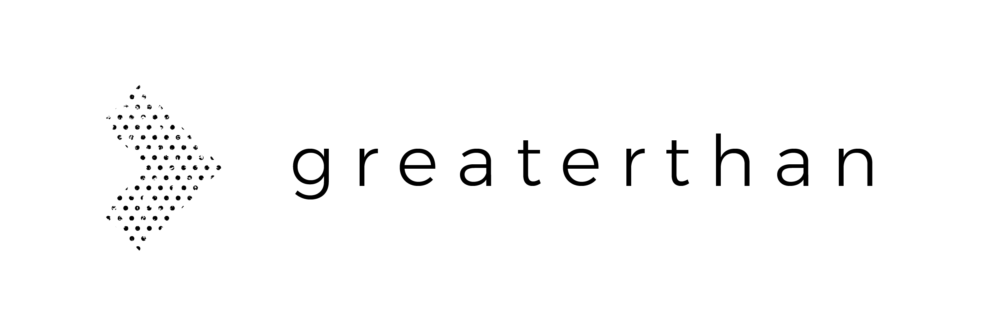

# About the authors

This guide is an initiative of **Kate Beecroft and Francesca Pick from** [**Greaterthan**](http://greaterthan.works), and organization that trains and advises teams at the forefront of decentralized, self-managed and participatory work. We use a variety of tools and practices to help these organizations face some of the biggest challenges related to power, money and governance. 

#### The foundations and first chapter of this guide were written by us, and what comes after depends on who contributes! 

**Francesca Pick** works in and with distributed networks and communities on collaborative governance practices. She helped build the international [Ouishare](http://ouishare.net) community and its conference [Ouishare Fest.](http://ouisharefest.com) Grown up between cultures, she loves bridge building: between \(organizational\) cultures, techies and intellectuals, startups and non-profits, budgeting and collaboration.

**Kate Beecroft** runs trainings for practitioners and theorists interested in self management and cooperative entrepreneurship. Her journey with self management started in the[ Enspiral network](http://enspiral.com). She believes that the principles of self management can help strengthen an emerging new economy where people create structures that serve them.

  

