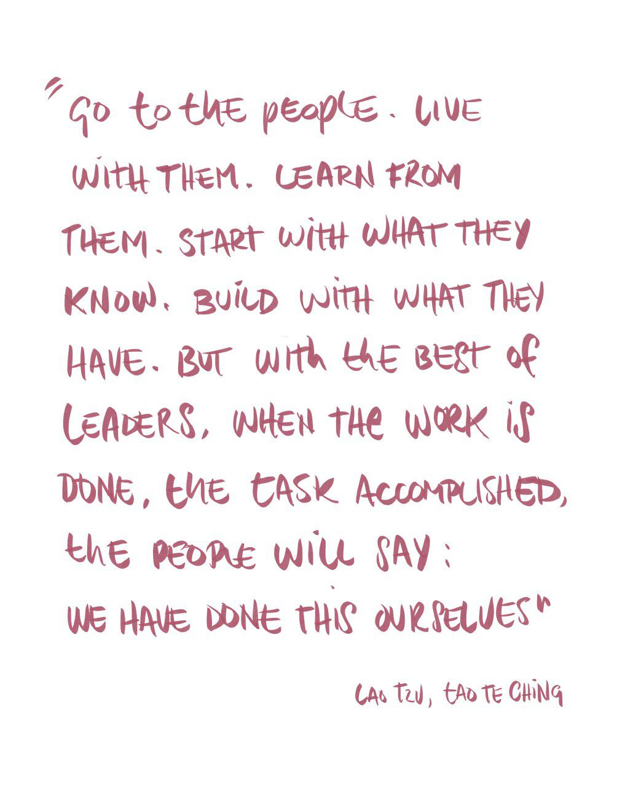

# Why this playbook

## **What is the purpose of this playbook and who is it for?**

This playbook is a guide for **people looking to set up a Decentralized Autonomous Organization \(DAO\)**. It starts with how to setup a DAO with decentralized budgeting \(with the help of a dapp such as [Alchemy](https://alchemy.daostack.io/)\), but it is a living document that will have many future chapters. These will be added gradually as our knowledge and practices grow.

**We, the authors of this playbook**, Kate Beecroft and Francesca Pick, have over a decade of experience in participatory governance, self-organization and community building in both the traditional and blockchain industries. The knowledge shared here stems from our first-hand experiences as leaders and practitioners in global networks such as [Enspiral](https://enspiral.com/) and [Ouishare](https://www.ouishare.net/), and the widespread practice of collaborative budgeting in these networks. We combine this knowledge with our more recent experience in a DAO community called the Genesis Alpha DAO, which we helped setup.

### **What does a guide to starting DAOs have to do with Taoism?** 

We know about as much about Taoism as we know about DAOs \(which is not so much, given how long DAOs have existed\), but our \(short\) life experience has taught us that as we imagine and experiment with things on the edge of possibility, we must be aware of what has come before us and ground ourselves in different forms of knowledge. The questions surfaced by the DAO concept about power in groups and organizations are in many ways the same questions we have considered for thousands of years. Many Taoist concepts, especially of [wu- wei \(which is “trying not to try](https://www.brainpickings.org/2014/04/21/trying-not-to-try-slingerland/)”\), revolve around the question of what power really means.

This is why we have decided to enrich this playbook with small Taoists lessons that we have sprinkled as quotes throughout the text \(mainly from the great Taoist text, the Tao Te Ching, typically attributed to the 6th-century BC sage [Laozi](https://en.wikipedia.org/wiki/Laozi)\). While fully aware that we are TAOist amateurs, we hope that adding a TAOist element to this playbook will pave the way for new types of conversations in the emerging DAO space.

**The impetus for writing this guide has been our experience in the Genesis Alpha DAO,** a DAO started by [DAOstack](https://daostack.io/), an organization building a full blockchain technology stack for the development of decentralized applications and organizations. In June 2018, DAOstack launched its first pilot called Genesis Alpha, to experiment with a prototype of the decentralized budgeting application called Alchemy. This name, maybe a funny coincidence and also an inspiration, reminds us of the Taoist concept of “Inner Alchemy”, in which [the human body becomes a laboratory](https://www.thoughtco.com/internal-alchemy-in-taoism-an-overview-3182918) for cultivating energies, for the purpose of improving physical, emotional and mental health; coming closer to the Tao and, ultimately, becoming an Immortal.

Since the field of DAOs is novel and the number of concrete applications is still small, we heavily draw from practical lessons, anecdotes and resources from the Genesis Alpha Pilot to make this guide tangible and actionable. After an introduction to some basic foundations, Chapter 1 focuses on the first key building block that you - the creator of the DAO - will need: setting up and running your first collaborative budgeting and funding cycle.

### **As you set off on your quest to start a DAO...**

we recommend keeping with one key principle of Taosim: **“Be Like Water” -** _flow like a river around the bends and curves._ In keeping with the Tao, we invite different interpretations and different ways of knowing.

The attempt of Alchemy, DAOs and collaborative communities in general is to revitalize human communities to become greater than the sum of their parts and foster closeness and collaboration.

\*\*\*

_**If you want to know more about the authors of this playbook, read here:**_



  

